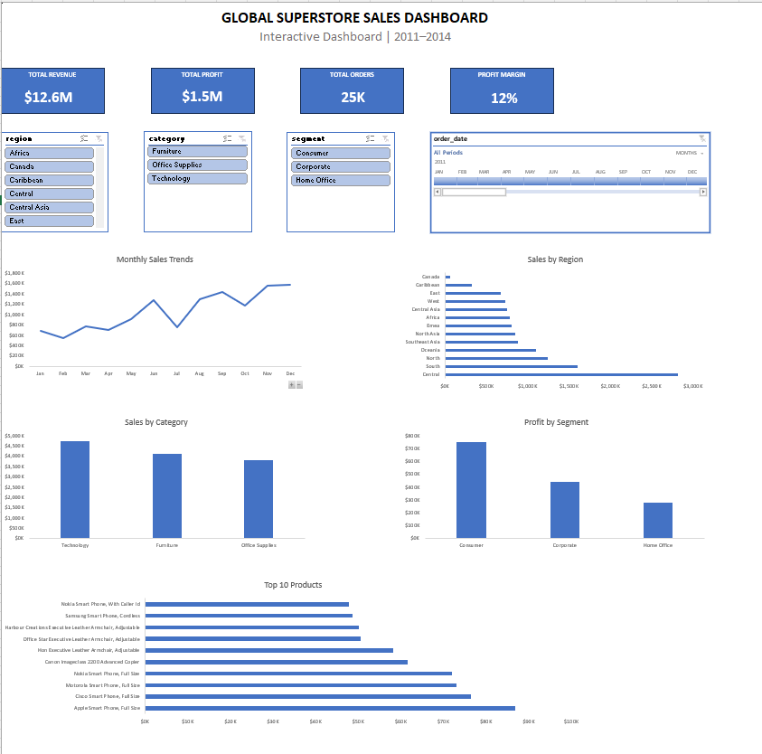

# Global Superstore Sales Dashboard

## Overview

This project presents an interactive sales dashboard built in Microsoft Excel using the Global Superstore dataset.

The dashboard allows business users to analyze sales performance across multiple dimensions including region, category, customer segment, products and time using interactive filters.

---

## Dashboard Preview



---

## Features

- Interactive KPI Cards
- Monthly Sales Trend
- Sales by Region
- Sales by Category
- Profit by Segment
- Top 10 Products
- Region Slicer
- Category Slicer
- Segment Slicer
- Timeline Filter
- Dynamic Pivot Charts
- Dynamic Pivot Tables

---

## Key Performance Indicators

| KPI | Description |
|-----|-------------|
| Total Revenue | Total Sales Generated |
| Total Profit | Overall Profit |
| Total Orders | Distinct Orders |
| Profit Margin | Profit ÷ Sales |

---

## Tools Used

- Microsoft Excel
- Pivot Tables
- Pivot Charts
- Slicers
- Timeline
- GETPIVOTDATA
- Excel Tables
- Dashboard Design

---

## Dashboard Components

- KPI Cards
- Monthly Sales Trend
- Sales by Region
- Sales by Category
- Profit by Segment
- Top 10 Products

---

## Skills Demonstrated

- Data Cleaning
- Data Analysis
- Dashboard Development
- Business Intelligence Reporting
- KPI Design
- Interactive Reporting
- Data Visualization
- Excel Automation

---

## Project Structure

```
Global-Superstore-Sales-Dashboard
|
|-- Dashboard
|-- Dataset
|-- Screenshots
|-- README.md
|-- LICENSE
|-- .gitignore

```

---

## Dataset

Global Superstore Dataset

---

## Author

Meghana Palagani